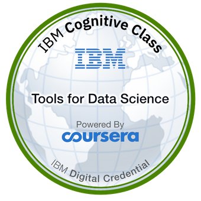

# Tools_for_DataScience

#### In this module, you will get an overview of the programming languages commonly used, including Python, R, Scala, and SQL. You’ll be introduced to the open source and commercial data science tools available. You’ll also learn about the packages, APIs, data sets and models frequently used by Data Scientists.

**Learning Objectives**

-----

* Cite popular open source, commercial, and cloud-based tools used by data scientists.
* Explain the function of an API and list some common API-related terms.
* Discuss the characteristics of a dataset and the ways data can be structured.
* Identify  some of the libraries used in data science and the types of functionalities a library can provide.
* Compare and contrast between machine learning, deep learning and their use cases.
* Discuss the different classes of machine learning models.
* Summarize the advantages of using a pre-trained model as opposed to training a model from scratch.
* Identify the languages, tools, and data used by data scientists.
* Access and explore data sets in the Data Asset Exchange (DAX).
* Examine deep learning models on the Model Asset Exchange (MAX) and interact with an image-detection deep learning model.

